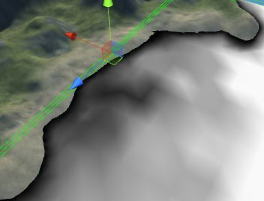

# 基于预渲染顶点色的水编辑器（适用移动端）

效果预览：

一、说明：

针对移动平台编写的水材质shader，考虑到各方面性能因素，为了实现类似基于深度图的水体深浅效果，采用预先从上往下渲染深度图并映射到Mesh顶点色的方式实现：

映射到顶点的Mesh效果：

但采用该方式需要高度依赖Mesh的顶点数量与分布，这样一方面如果交由美术制作Mesh则制作成本较高，且不容易控制顶点的分布，修改也比较麻烦，另一方面通过程序生成简单的mesh又需要较高的顶点数才能满足效果要求，如下，低顶点数的Mesh无法体现海边波纹的效果：

因此改进程序生成Mesh的算法，采用基于Lod的Mesh细分方法，对于接近岸边的Mesh，给予最高Lod，将获得最多的顶点数量，而远离岸边的水域，由于不需要过多细节，则给予较低的Lod，只会产生较少顶点，同时对于会被陆地遮挡的部分，则根本不产生顶点，这样即可保证岸边的浪花具有更多细节，如下改进后生成的网格：

被陆地遮挡部分不会产生三角形：

另外编辑器提供了可以自定义绘制顶点色的工具，方便后期调整顶点色。

二、使用方法：

1.如何生成LodMesh:

1).点击GameObject/UnlitWater/Create UnlitWater打开编辑器界面

2).在载体目标处拖入一个场景中的GameObject（最好是空的）

3).Mesh生成器类型选择LodMesh

4).参数：

​	调整Width和Height直到整个水面的尺寸

​	调整CellWidth，CellHeight，最大Lod，来调整网格细分粒度，注意蓝线为Lod最低的格子大小，黄线为Lod最高的格子大小：

​	

​	调整UV水平方向（这个参数一般需要自己根据需求调节）

​	调整上方高度参数和下方高度参数，使得绿色包围盒的下方刚好到达水体最低部，上方超出陆地最高部，如下：

​	

5).点击渲染，生成深度图，该深度图可以保存成文件，同样可以在文件中编辑后再载入到编辑器。另外如果对深度图的深度效果不满意可以调整最大深度范围参数和深度增强参数。

6).点击生成Mesh即可完成操作，生成的Mesh保存成.asset文件并自动附加到载体目标上

2.如何应用顶点色到普通的模型Mesh上:

1).打开编辑器

2).将已经在场景中的带有Mesh的物体拖入载体目标，出现提示：“Mesh来自模型文件，需要生成拷贝Mesh”，点击生成拷贝将Mesh拷贝出来

3).同样调整上方高度参数和下方高度参数，使得绿色包围盒的下方刚好到达水体最低部，上方超出陆地最高部

4).点击渲染

5).点击应用到顶点色，完成操作

3.如何设置光照方向:

将灯光拖入"平行光"选框，点击设置光照方向

4.如何绘制顶点色:

1).打开编辑器

2).拖入已经生成的Mesh的物体到载体目标

3).在顶点绘制中选择绘制通道，并直接在场景中的Mesh上绘制：

同时可以勾选预览顶点色来开启顶点色的强度预览模式：

Ps.编辑器部分采用USubWindow扩展来快速开发EditorWindow，详见：https://github.com/AsehesL/USubWindow

